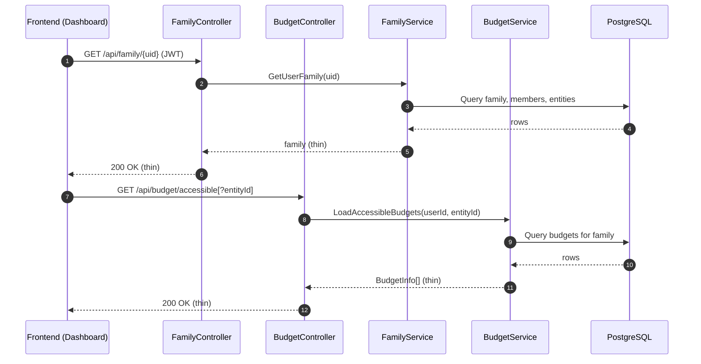
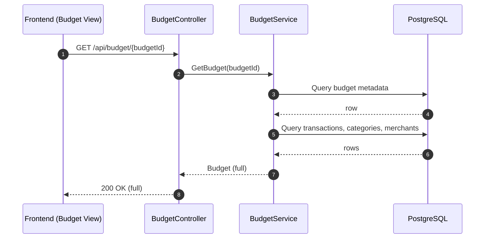

# SRFM Architecture Overview

This document maps the system at a glance and highlights the recent lazy-loading changes to improve initial load times.

## System Overview
- Frontends: Two Vue apps
  - `app/` (Vuetify) and `q-srfm/` (Quasar)
  - State via Pinia stores (`family`, `budget`)
- API: ASP.NET Core (`api/*`)
  - Controllers: `FamilyController`, `BudgetController`, `AccountController`, `SyncController`
  - Services: `FamilyService`, `BudgetService`, `AccountService`, `SyncService`
  - Auth: Firebase JWT enforced by `AuthorizeFirebase`
- Data: Supabase/PostgreSQL via `SupabaseDbService`
- Email: `BrevoService` for invites

## Component Map (ASCII)
[Browser: Vue (app/, q-srfm/)]
  ├── Pinia: family store (entities, selection)
  └── Pinia: budget store (thin list; hydrate on demand)
         │             │
         ▼             ▼
[ASP.NET Core API Controllers] ─────> [Service Layer]
  ├── /api/family/{uid}         ├── FamilyService
  ├── /api/budget/accessible    ├── BudgetService
  ├── /api/budget/{budgetId}    └── AccountService
  └── /api/families/{id}/...           │
                                       ▼
                                [PostgreSQL (Supabase)]
                                       │
                                       ▼
                                [Firebase Auth verify]
                                       │
                                       ▼
                                  [Brevo emails]

## Key Endpoints
- Family
  - GET `/api/family/{uid}`: Thin payload (family + members + entities only)
  - Entity CRUD under `/api/family/{familyId}/entities/...`
- Accounts & Snapshots
  - GET `/api/families/{familyId}/accounts`
  - GET `/api/families/{familyId}/snapshots`
- Budgets
  - GET `/api/budget/accessible[?entityId=...]`: Thin list (metadata only)
  - GET `/api/budget/{budgetId}`: Full budget (transactions, categories, merchants)
  - Transactions CRUD and batch ops under `/api/budget/{budgetId}/transactions...`
  - Imported transactions under `/api/budget/imported-transactions...`

## Primary Flows
1) Dashboard Load (Fast, Thin)
- Frontend loads family and accessible budgets without heavy data.
- Details are fetched on interaction.

2) Budget Selection (Hydrate On Demand)
- When a budget is selected, fetch full details for that budget only.

3) Accounts/Snapshots (Separate Screens)
- Loaded via dedicated endpoints only when those pages are visited.

## Mermaid: System Context
```mermaid
flowchart LR
  subgraph Browser[Vue Frontends]
    A1[app/ (Vuetify)]
    A2[q-srfm/ (Quasar)]
    S1[Pinia: family]
    S2[Pinia: budget]
    A1 --> S1
    A1 --> S2
    A2 --> S1
    A2 --> S2
  end

  subgraph API[ASP.NET Core API]
    C1[FamilyController]
    C2[BudgetController]
    C3[AccountController]
    C4[SyncController]
    SV1[FamilyService]
    SV2[BudgetService]
    SV3[AccountService]
    C1 --> SV1
    C2 --> SV2
    C3 --> SV3
  end

  DB[(PostgreSQL / Supabase)]
  Auth[Firebase Auth]
  Email[Brevo]

  S1 -- JWT --> API
  S2 -- JWT --> API
  API --> DB
  API --> Auth
  C1 --> Email

  %% Highlight thin endpoints
  note right of C1: /api/family/{uid}\n(thin: no accounts/snapshots)
  note right of C2: /api/budget/accessible\n(thin list)
```

## Mermaid: Sequence (Dashboard Load)


## Mermaid: Sequence (Budget Selection)


## Lazy Loading & Caching
- Family: Only core info returned on initial load; accounts and snapshots fetched on demand.
- Budgets: List returns summaries; the store fetches full details only when needed (e.g., selection, carryover calcs).

## Performance Considerations
- Reduced payload size and DB round-trips on initial load.
- Consider DB indexes:
  - `family_members(user_id)\]
  - `budgets(family_id, entity_id)`
  - `accounts(family_id)`
  - `snapshots(family_id)`
- Consider pagination or month filters for large budget lists.

## File Pointers
- api/Services/FamilyService.cs:90
- api/Services/BudgetService.cs:38
- app/src/dataAccess.ts:320
- q-srfm/src/dataAccess.ts:294
- q-srfm/src/store/budget.ts:1

