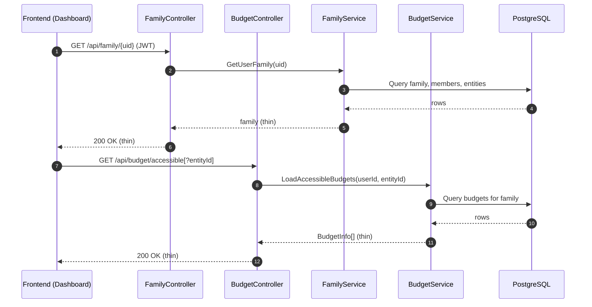
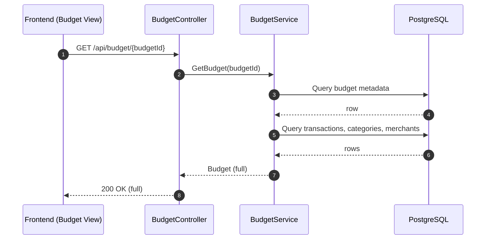

# ChatGPT Prompt: Generate SRFM Architecture PNG Diagrams

Copy the prompt below into ChatGPT (preferably a model that can render images or supports Mermaid rendering). It will produce high‑resolution PNG diagrams that visualize the app and its main flows.

---

You are a diagramming assistant. Generate PNG images for the following Mermaid diagrams. Output each diagram as:
- A rendered PNG (high resolution, transparent background if possible)
- The original Mermaid source
- A short caption

Naming:
- system-context.png
- dashboard-load-sequence.png
- budget-selection-sequence.png

If you cannot embed PNGs directly, provide download links or a single ZIP link containing the PNGs. Keep layout readable on 1920×1080 screens and mobile. Use consistent colors and spacing.

Mermaid Diagrams to Render:

1) System Context
```mermaid
flowchart LR
  %% SRFM Architecture: System Context
  subgraph Browser[Vue Frontends]
    A1[app/ (Vuetify)]
    A2[q-srfm/ (Quasar)]
    S1[Pinia: family]
    S2[Pinia: budget]
    A1 --> S1
    A1 --> S2
    A2 --> S1
    A2 --> S2
  end

  subgraph API[ASP.NET Core API]
    C1[FamilyController]
    C2[BudgetController]
    C3[AccountController]
    C4[SyncController]
    SV1[FamilyService]
    SV2[BudgetService]
    SV3[AccountService]
    C1 --> SV1
    C2 --> SV2
    C3 --> SV3
  end

  DB[(PostgreSQL / Supabase)]
  Auth[Firebase Auth]
  Email[Brevo]

  S1 -- JWT --> API
  S2 -- JWT --> API
  API --> DB
  API --> Auth
  C1 --> Email

  %% Thin endpoints highlighted
  note right of C1: /api/family/{uid}\n(thin: no accounts/snapshots)
  note right of C2: /api/budget/accessible\n(thin list)
```

2) Dashboard Load (Thin)


3) Budget Selection (Hydrate On Demand)


Style/Rendering Guidance:
- Use readable font sizes; avoid overlapping labels.
- Prefer left-to-right for the context diagram; keep services grouped.
- Keep sequence diagrams to ~8–10 lifelines/steps visible at once.
- Colors: distinct accents for Frontend vs API vs DB.
- Export at 2x scale for crispness.

---

Tip: You can also reconstruct these from the source at `docs/architecture.md` if needed.

